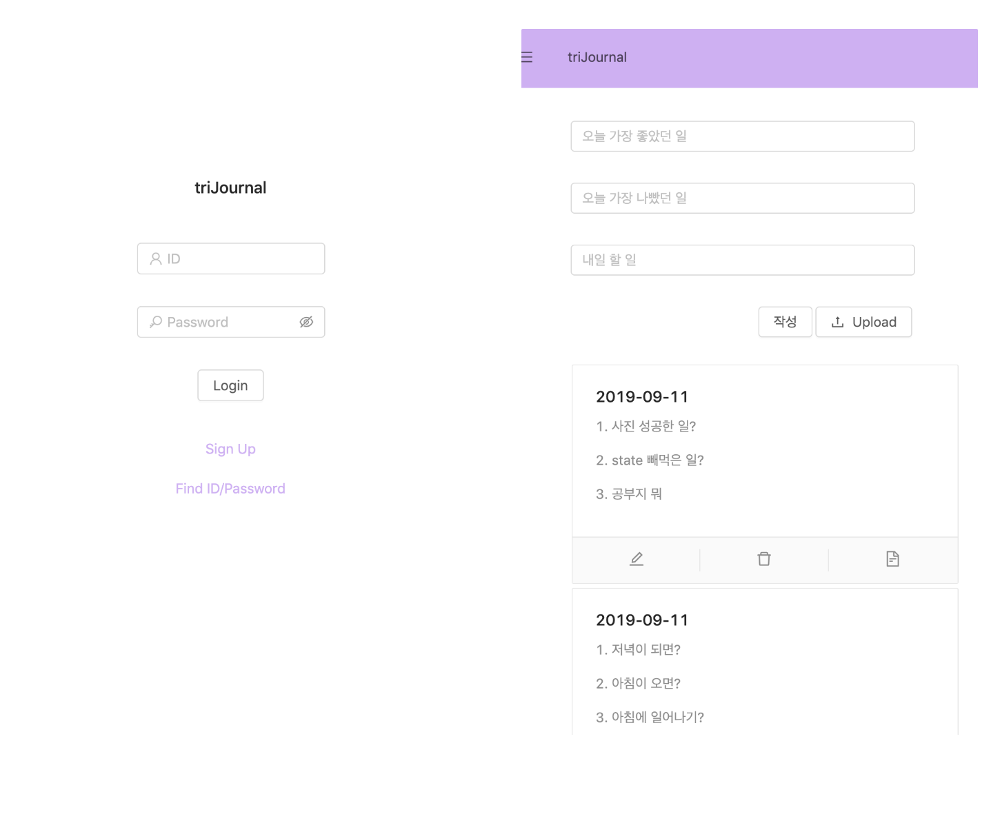
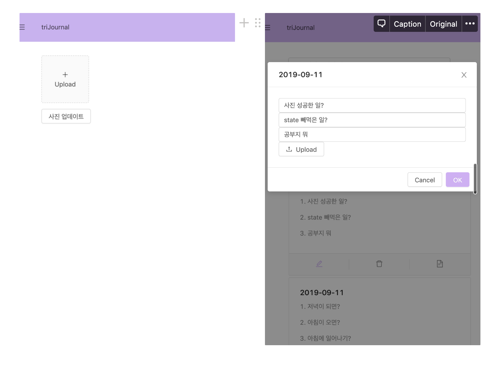

# triJournal

## 프로젝트 소개

triJournal은 자신만의 일을 세줄 일기로 기록하는 서비스입니다. 하루 중 좋았던 일, 나빴던 일, 내일 할 일을 적는 서비스입니다.
이미지 업로드가 가능하고 자신이 작성한 일기를 list로 볼 수 있습니다.

## Start

```
npm start
```

### Stacks

- javascript
- react.js
- node.js
- antdesign

### 시연화면




### Release History

- 0.1.0 (첫 배포)
